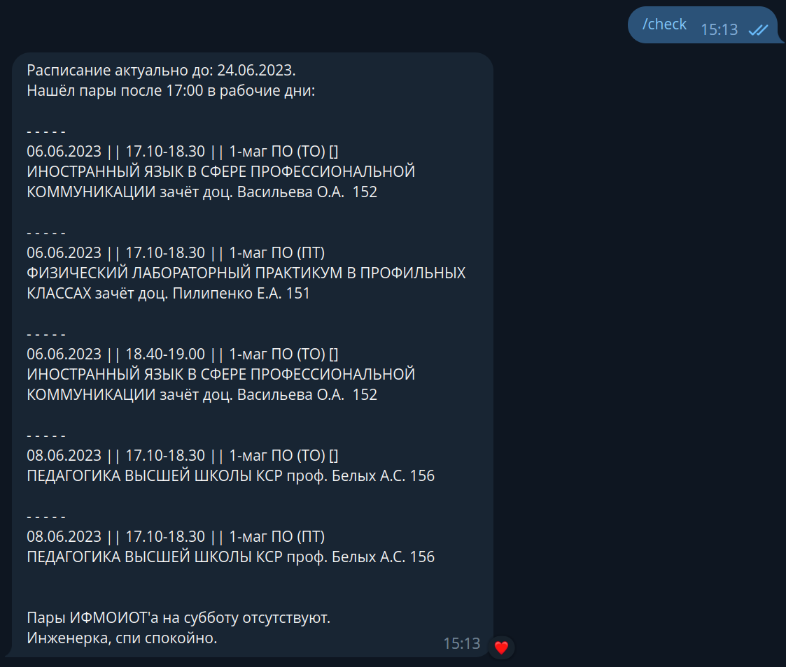
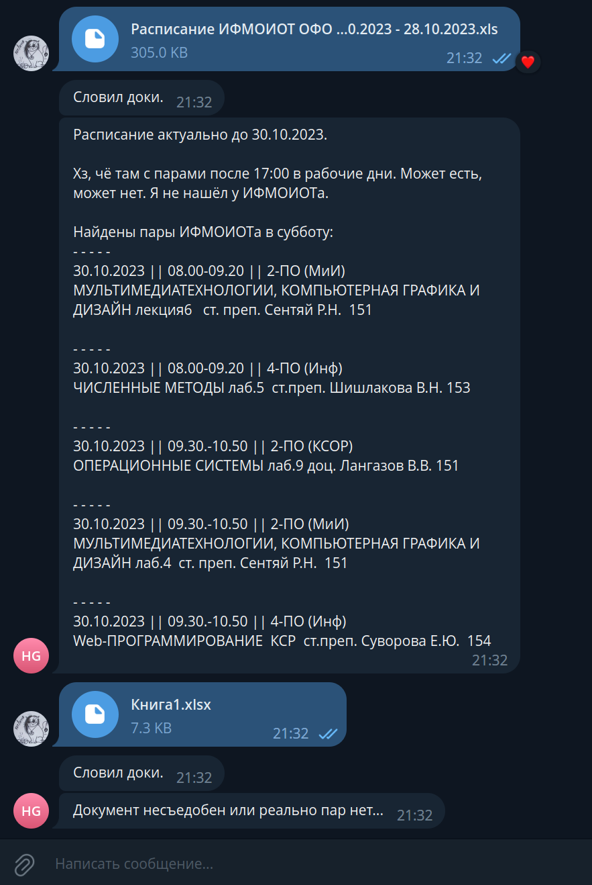

# CheckSaturday
Эта программа написана инженером ИОТС для инженеров ИОТС.  
Проверяет пары на кафдре в субботу. Если их нет -- значит наконец у инженеров 2 выходных.  
UPD: Теперь она так же проверяет, есть ли пары на кафедре после 17:00 в будние дни.  
  
  
Программу можно добавить в беседу инженеров.  
Для проверки наличия пар на кафедре в субботу -- выполнить команду `/check`.  

UPD 2: Так как директорат редко публикует расписания на сайте вовремя, теперь можно отправлять excel файлы с расписанием боту.  
В беседе он не будет отвлекать, т.к. отвечает только на .xls и .xlsx файлы.  

